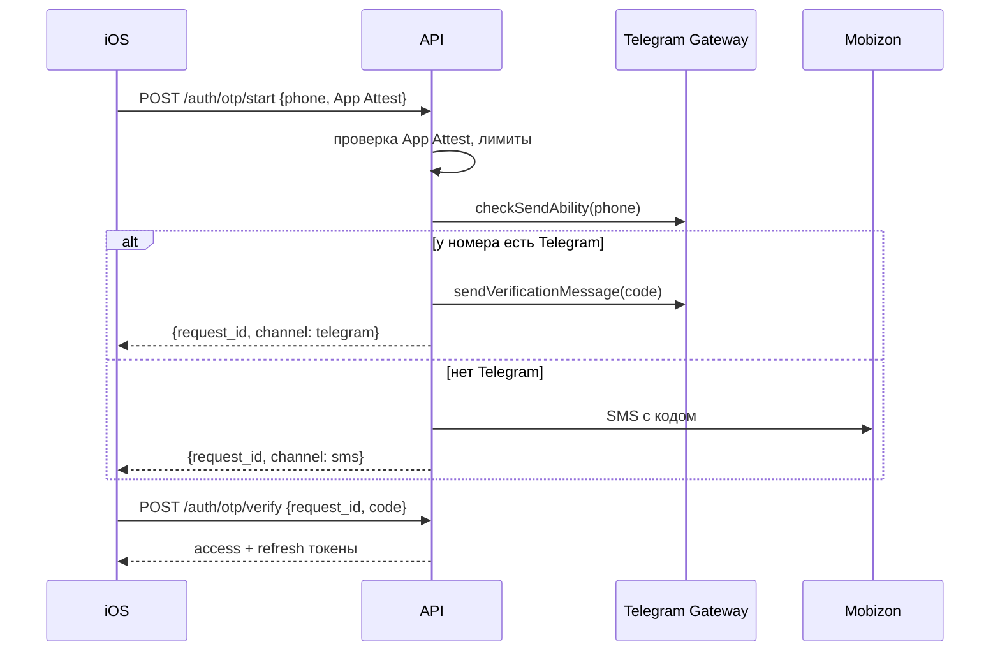

# Бэкенд

## Форма

**Модульный монолит**: один сервис API и один процесс воркеров из одной кодовой базы, общая
PostgreSQL. Модули разделены по папкам и границам (свои таблицы, свои сервисы), общаются через
интерфейсы, а не через общие таблицы. Разделить на сервисы можно позже, если понадобится.

Postgres — единственная stateful-зависимость: данные, геозапросы (PostGIS), полнотекстовый и
нечёткий поиск (pg_trgm), очередь фоновых задач (pg-boss). Redis не нужен.

## Язык: TypeScript или Swift

| | **TypeScript (рекомендую)** | Swift (Vapor) |
|---|---|---|
| Один язык | API + админка + веб-страницы + скрипты | API + iOS; админка всё равно на вебе (второй стек или Directus) |
| Экосистема | Зрелая: sharp (изображения), pg-boss, генерация OpenAPI, клиенты APNs, S3, SMS | Меньше готовых библиотек, чаще придётся писать самим |
| Общие типы с iOS | Через генерацию Swift-клиента из OpenAPI | Можно делить модели напрямую (или тоже через OpenAPI) |
| Для вас | Второй язык | Знакомый язык |
| Для Claude | Больше примеров → надёжнее код | Хорошо, но примеров меньше |
| Сборка и деплой | Быстро, лёгкие Docker-образы | Сборка под Linux медленнее |

Рекомендация — TypeScript: админка и веб-страницы для шаринга всё равно веб, и один язык на всю
серверную часть проще для одного разработчика. Если выберете Swift — архитектура ниже не
меняется, меняются только библиотеки.

## Стек (TypeScript)

| Задача | Выбор |
|--------|-------|
| Runtime | Node.js 24 LTS |
| HTTP | Fastify 5 |
| Валидация и OpenAPI | Zod-схемы → OpenAPI 3.1 (fastify-type-provider-zod) → `contracts/openapi.yaml` |
| Доступ к БД | Kysely (типобезопасный SQL, удобно для PostGIS) + kysely-codegen из схемы БД |
| Миграции | Чистые SQL-файлы (dbmate) — PostGIS проще писать на SQL |
| Фоновые задачи | pg-boss (очередь в Postgres) |
| Изображения | sharp (libvips) |
| JWT | jose (ES256) |
| Пуши | APNs напрямую (token-based, ключ `.p8`) |
| S3 | AWS SDK v3 (совместим с S3 провайдеров в РК) |
| Логи | pino (JSON) |
| Тесты | Vitest + Testcontainers (реальный PostGIS в Docker) |
| Качество | TypeScript strict, ESLint, Prettier |

## Модули

| Модуль | Отвечает за |
|--------|-------------|
| `auth` | Коды входа, Apple/Google, токены, сессии, App Attest, удаление аккаунта |
| `users` | Профиль, настройки, приватность по умолчанию, зоны приватности |
| `social` | Друзья, запросы, блокировки, сопоставление контактов, списки друзей (1.1) |
| `places` | Места, зоны, атрибуты, дубли, предложения правок, сохранённые/любимые |
| `checkins` | Чекины и отчёты, подтверждение по геопозиции |
| `trips` | Поездки, треки, участники, статистика |
| `catches` | Уловы, личные рекорды, рекорды места (1.1) |
| `reviews` | Отзывы, «полезно» |
| `threads` | Треды, сообщения, упоминания, подписки |
| `media` | Загрузки, обработка, варианты, доступ |
| `feed` | Лента активностей друзей |
| `regulations` | Правила, версии по годам, пакеты для офлайна, запрос «что действует здесь» |
| `content` | Статьи, шаблоны чеклистов, справочник рыб, подборки |
| `gear` | Экипировка, свои чеклисты и сборы |
| `notifications` | Пуши, уведомления в приложении, настройки, тихие часы |
| `moderation` | Жалобы, фильтры, очереди, действия модераторов |
| `gamification` | Очки вклада, уровни, бейджи |
| `search` | Поиск мест, зон, пользователей |
| `sync` | Изменения для клиента по курсору |
| `admin` | API админки с ролями |
| `analytics` | Приём продуктовых событий |

## API

**Принципы:**
- REST, JSON, версия в пути (`/v1`), контракт — OpenAPI 3.1.
- Создание и изменение своих объектов — `PUT /v1/<объекты>/{id}` с ID от клиента (UUIDv7):
  идемпотентно, удобно для офлайн-очереди.
- Пагинация — курсоры; кэширование — `ETag`.
- Язык ответов — `Accept-Language` (`ru`, `kk`, `en`).
- Ошибки — `application/problem+json` (RFC 9457) с машинными кодами.
- Координаты — GeoJSON, порядок `[lon, lat]`.

**Основные эндпоинты (набросок, детали — на Этапе 4):**

| Группа | Эндпоинты |
|--------|-----------|
| Вход | `POST /v1/auth/otp/start`, `POST /v1/auth/otp/verify`, `POST /v1/auth/apple`, `POST /v1/auth/google`, `POST /v1/auth/refresh`, `POST /v1/auth/logout` |
| Я | `GET/PATCH /v1/me`, `DELETE /v1/me`, `GET /v1/me/stats?period=` |
| Люди | `GET /v1/users/{id}`, `GET /v1/users/{id}/trips` |
| Друзья | `POST /v1/friends/requests`, `POST /v1/friends/requests/{id}/accept`, `DELETE /v1/friends/{userId}`, `POST /v1/contacts/match`, `POST /v1/blocks` |
| Места | `GET /v1/places?bbox=&filters`, `GET /v1/places/{id}`, `PUT /v1/places/{id}`, `POST /v1/places/{id}/suggestions`, `PUT/DELETE /v1/places/{id}/save` |
| Активность | `PUT /v1/checkins/{id}`, `PUT /v1/trips/{id}`, `PUT /v1/trips/{id}/track`, `PUT /v1/catches/{id}` |
| Отзывы и треды | `PUT /v1/places/{id}/review`, `GET /v1/places/{id}/reviews`, `GET/POST /v1/places/{id}/threads`, `GET/POST /v1/threads/{id}/posts` |
| Медиа | `POST /v1/media/uploads` (presigned URL), `POST /v1/media/{id}/complete` |
| Лента и синхронизация | `GET /v1/feed?cursor=`, `GET /v1/sync?cursor=` |
| Правила | `GET /v1/regulations/packs/{region}`, `GET /v1/regulations/at?lat=&lon=&date=` |
| Контент | `GET /v1/articles`, `GET /v1/checklist-templates`, `GET /v1/species`, `GET /v1/collections` |
| Прочее | `GET /v1/search?q=`, `GET /v1/notifications`, `PUT /v1/devices/{token}`, `POST /v1/reports` |
| Админка | `/admin/v1/…` — отдельный набор с ролями |

## Авторизация

### Вход по телефону

- Код: 6 цифр, живёт 5 минут, до 5 попыток, повторная отправка — через 60 с; «не пришёл в
  Telegram → отправить SMS». В БД хранится только хеш кода.
- **Защита от SMS-фрода** (накрутка SMS на платные номера — частая атака):
  - код не отправляется без валидной аттестации App Attest;
  - лимиты: на номер (3 в час, 10 в сутки), на IP, на устройство;
  - SMS — только на казахстанские мобильные номера (+7 7xx); остальные страны — только Telegram;
  - дневной бюджет на SMS и оповещение при всплеске.
- Каналы и цены: Telegram Gateway — $0,01 за доставленный код; SMS Mobizon — 60,8 ₸ с общей
  подписью, со своей подписью «Dalada» — 16,6–17,8 ₸ + абонплата (переходим при ~1 200+ SMS в месяц).
- Telegram Gateway получает номер телефона — это трансграничная передача ПД: пункт в согласии,
  проверка юристом (вопрос 4 в [README](README.md#вопросы-к-этапу-3)).

### Apple и Google

- Sign in with Apple: проверяем identity token по ключам Apple (JWKS).
- Google: OAuth 2.0 + PKCE на клиенте, на сервере проверяем `id_token`.
- У пользователя может быть несколько способов входа (телефон, Apple, Google) → таблица
  `auth_identities`. После входа через Apple/Google просим привязать телефон (можно отложить).

### Токены и сессии

- Access — JWT (ES256), 15 минут. Refresh — случайная строка, 60 дней, **ротация** при каждом
  обновлении, в БД — только хеш, привязка к устройству.
- Выход и удаление аккаунта отзывают все сессии. Удаление аккаунта — мягкое на 30 дней, затем
  полная очистка ПД (публичный вклад анонимизируется).

## Модель данных (набросок)

PostgreSQL 17 + PostGIS. Геометрии — SRID 4326; расстояния — через `geography`. Полная схема —
на Этапе 4.

| Таблица | Ключевые поля |
|---------|---------------|
| `users` | id, phone (E.164, уникальный), username, name, avatar, city, language, settings (jsonb), role, deleted_at |
| `auth_identities`, `sessions`, `otp_requests`, `devices` | способы входа, refresh-сессии, запросы кодов, APNs-токены |
| `friendships`, `friend_requests`, `blocks` | взаимные связи, запросы, блокировки |
| `zones` | kind (водоём, участок реки, нацпарк, погранзона…), name_i18n, geom (MultiPolygon) |
| `regulations` | zone_id, kind, period (daterange), year, species[], gear[], text_i18n, fine_i18n, source_url, verified_at |
| `places` | author_id, type, name, name_i18n, geom (Point), access_point, approach_route (LineString), attributes (jsonb), visibility, approximate, fuzz_offset, status, zone_id, счётчики |
| `place_saves`, `place_suggestions` | сохранённые/любимые, предложения правок |
| `checkins` | user_id, place_id, trip_id, at, geom, verified, conditions (jsonb), note, visibility |
| `trips`, `trip_participants` | activity, started_at, ended_at, stats (jsonb), track (LineString, упрощённый), track_key (S3, исходник), visibility |
| `catches` | user_id, trip_id, checkin_id, place_id, species_id, weight_g, length_mm, count, method, bait, released, at, visibility, hide_location, hide_size |
| `reviews` | place_id + user_id (уникально), rating 1–5, text, visited_on |
| `threads`, `thread_posts`, `thread_subscriptions` | обсуждения мест и зон |
| `media` | owner_id, parent (тип + id), kind, ключи вариантов в S3, размеры, blurhash, status |
| `reactions`, `comments` | к поездкам, уловам, чекинам |
| `activities` | actor_id, type, object, visibility, created_at — основа ленты |
| `notifications`, `notification_prefs` | уведомления в приложении и настройки |
| `reports`, `moderation_actions` | жалобы и решения |
| `points_ledger`, `badges`, `user_badges` | геймификация (журнал очков — только добавление) |
| `gear_items`, `checklists`, `checklist_items`, `checklist_runs` | экипировка и сборы |
| `articles`, `checklist_templates`, `fish_species`, `collections` | контент с переводами (jsonb по языкам) |
| `events` | продуктовая аналитика (партиции по месяцам) |

## Приватность в коде

Самая важная часть бэкенда — ошибка здесь раскрывает чужие секретные места.

1. **Единая политика видимости.** Все запросы списков строятся через один SQL-предикат
   «видно ли зрителю» (автор / друг / выбранные / все; блокировки); отдельные проверки для
   одиночных объектов — через одну функцию политики. Никаких «ручных» условий в эндпоинтах.
2. **Координаты режутся на сервере.** Клиент без доступа никогда не получает точную точку:
   - приблизительное место → центр со **стабильным** смещением + радиус (смещение генерируется
     один раз и хранится; случайное смещение при каждом запросе можно усреднить и найти точку);
   - «Секретное место» в поездке или улове → `place: null`, `location: null`, участки трека рядом
     с местом вырезаны.
3. **Зоны приватности** обрезают трек при выдаче другим; исходный трек хранится целиком и виден
   только автору.
4. **Матрица тестов видимости** обязательна: зритель (автор, друг, чужой, заблокированный, гость) ×
   объект (место, поездка, чекин, улов, медиа) × уровень видимости × приблизительность.
5. **Postgres RLS** как вторая линия защиты — решим на Этапе 4.
6. Логи и аналитика не содержат точных координат и номеров телефонов.

## Лента, поиск, популярность

- **Лента:** при создании поездки, отчёта, улова, места, отзыва пишем строку в `activities`;
  лента = активности друзей, видимые зрителю, по времени с курсором. Для масштаба MVP
  (десятки тысяч пользователей) этого достаточно.
- **Поиск:** pg_trgm по нормализованным названиям на трёх языках; нормализация казахских букв
  (ә→а, ғ→г, қ→к, ң→н, ө→о, ұ→у, ү→у, һ→х, і→и) и `unaccent`; ранжирование — похожесть ×
  популярность × расстояние.
- **Популярность:** материализованное представление по формуле из
  [плана «Мест»](../02-plan/03-places.md#ранжирование-популярных-mvp), обновляется задачей раз в 15–60 мин.

## Медиа

1. `POST /v1/media/uploads` → presigned PUT в `uploads/` (лимит размера и типа).
2. Клиент загружает файл напрямую в S3.
3. `complete` → задача обработки: проверка типа, повторное удаление EXIF, варианты 256 / 1080 /
   2048 px (JPEG или WebP), blurhash, проверка на NSFW (open-source модель внутри воркера,
   без отправки фото наружу).
4. Статус `ready` → медиа видно по правилам видимости родителя.

Доступ: публичные медиа — через CDN; остальные — короткоживущие подписанные ссылки.
Видео (1.1) — перекодирование ffmpeg в воркере.

## Правила (регламенты)

- `zones` + `regulations` с периодами по годам; редактор в админке (геометрия + тексты + источник).
- Задача сборки **пакетов правил** по регионам (сжатый GeoJSON + версия) при каждой публикации
  изменений → S3/CDN → клиент скачивает при обновлении.
- `GET /v1/regulations/at` — для онлайн-проверки (форма улова, флаги браконьерства).

## Уведомления

- APNs напрямую (token-based), отправка через очередь; тексты на языке получателя (шаблоны RU/KK/EN).
- Настройки по типам, тихие часы, группировка; уведомления в приложении — таблица `notifications`.
- Плановые: «запрет начнётся через 3 дня» (зоны сохранённых мест), «сборы на завтра».

## Модерация и геймификация

- Синхронные проверки при создании: фильтр слов (RU/KK/EN), ссылки, лимиты частоты.
- Асинхронные: NSFW на фото, дубли мест, флаги браконьерства (улов в зоне действующего запрета) →
  очередь модерации в админке.
- Автоскрытие при N жалобах до решения модератора.
- Очки — журнал `points_ledger` (только добавление), начисление после прохождения проверок;
  бейджи вычисляет фоновая задача.

## Админка

- SPA на React + Refine, работает через `/admin/v1` с ролями: администратор, редактор, модератор.
- Редактор геометрий — MapLibre GL JS + Terra Draw (рисование зон, участков рек, точек).
- Редактор статей — Markdown с фото; вкладки языков RU / KK / EN и статус перевода.
- Журнал действий админов (кто, что, когда).

## Фоновые задачи (pg-boss)

Обработка медиа · рассылка пушей · пересчёт популярности · сборка пакетов правил · напоминания о
запретах и сборах · начисление очков и бейджей · очистка (просроченные коды, брошенные загрузки,
удалённые аккаунты) · агрегаты аналитики.
