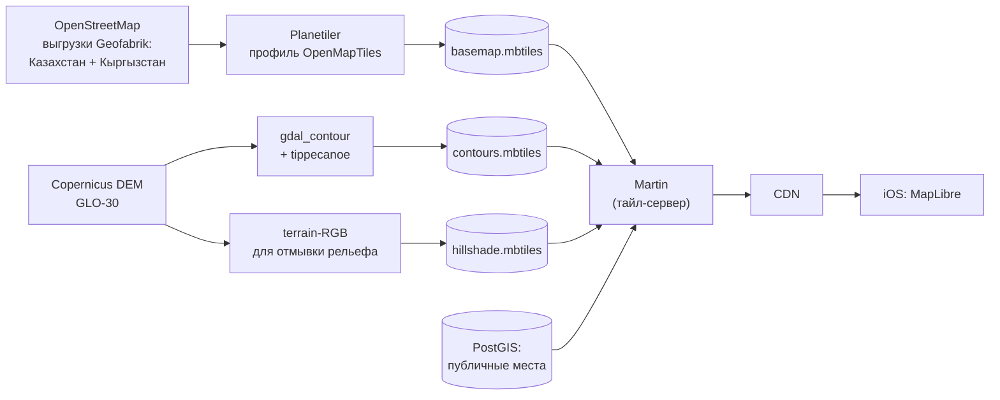

# Карты и геоданные

## Требования (из плана)

- Стили «Outdoor» (рельеф, горизонтали, тропы, грунтовки, вода) и «Спутник».
- **Офлайн-пакеты** регионов Алматинской области и Жетісу.
- Свои слои: публичные места (тысячи точек, кластеры), свои и дружеские места, запреты, нацпарки,
  погранзона, треки.
- Подписи на русском, казахском и английском.
- Никакой передачи геолокации пользователей третьим лицам.
- Бюджет близок к нулю.

## Выбор SDK

| | **MapLibre Native (рекомендую)** | Mapbox Maps SDK | Apple MapKit |
|---|---|---|---|
| Лицензия и цена | Open source (BSD), бесплатно при любом числе пользователей | Бесплатно до 25 тыс. MAU, дальше $4 за 1 000 MAU; офлайн тарифицируется по запросам тайлов | Бесплатно |
| Офлайн-пакеты | Есть (`MLNOfflineStorage`, `MLNTilePyramidOfflineRegion`) | Есть (TileStore) | **Нет** для сторонних приложений |
| Данные карты | Свои тайлы из OpenStreetMap — делаем сами | Готовые стили Outdoors и Satellite с рельефом | Готовые, но без троп и горизонталей |
| Спутник | Подключаем провайдера онлайн | Встроенный | Встроенный |
| Телеметрия | Нет | По умолчанию собирает обезличенную геолокацию, в том числе в фоне; пользователю обязаны дать отключение | Apple |
| Кастомизация стиля | Полная (стиль — наш JSON) | Полная (Mapbox Studio) | Ограниченная |
| Работа для одного разработчика | +2–3 недели на сборку тайлов и стиля (скрипты, один раз) | Минимум | Минимум, но нет офлайна — не подходит |

**Рекомендация — MapLibre + свои тайлы.** Причины: обещание приватности для рыбаков («твои места и
треки не уходят третьим лицам»), хранение данных в РК, нулевая стоимость при росте, свой стиль в
духе DesignKit. Работа по тайлам — это скрипты, которые пишутся один раз и запускаются по
расписанию. Слой `MapEngine` в приложении изолирует SDK: если спайк S1 провалится, переходим на
Mapbox, не трогая фичи.

## Базовая карта: свои векторные тайлы

- **Источник:** OpenStreetMap (выгрузки Geofabrik). Кыргызстан добавляем, чтобы покрыть хребты
  южнее Алматы — граница идёт по гребням. Лицензия ODbL: указываем «© OpenStreetMap contributors».
- **Сборка:** Planetiler (профиль OpenMapTiles) → MBTiles. Для региона такого размера — минуты на
  обычной машине. Пересборка раз в месяц (задача CI или на VM).
- **Рельеф:** Copernicus DEM GLO-30 (свободная лицензия с указанием источника) → горизонтали
  (например, через 20 м и 100 м) и тайлы отмывки рельефа.
- **Раздача:** Martin (тайл-сервер проекта MapLibre) отдаёт MBTiles и тайлы из PostGIS → CDN.
- **Стиль:** свой JSON-стиль «Outdoor» (светлый и тёмный) с цветами из токенов DesignKit.
  - Подписи: `name:kk` / `name:ru` / `name:en` с запасным `name` — по языку приложения.
  - Шрифты подписей (glyphs) собираем из Inter с казахскими буквами (проверка в спайке S1).
  - Иконки на карте — из открытого набора (например, Maki, CC0), а не SF Symbols: их лицензия
    ограничивает использование платформами Apple, а стиль потом понадобится вебу и Android.

## Офлайн-пакеты

- Заранее заданные регионы (из [плана «Карты»](../02-plan/02-map.md#28-офлайн-карты)) — границы и
  диапазон масштабов (ориентир: базовая карта z6–z15, горизонтали z10–z14, рельеф z8–z13).
- Скачивание — `MLNOfflineStorage`; размер каждого пакета и время загрузки измеряем в спайке S1.
- Вариант Б, если загрузка тайл-за-тайлом окажется медленной: готовый файл региона одним куском.
  У MapLibre Native есть поддержка PMTiles, но скачивание офлайн-пакетов из PMTiles пока
  работает с ограничениями (issue maplibre-native #3691) — проверяем в спайке.
- Вместе с картой скачивается пакет правил региона (см. [бэкенд](02-backend.md#правила-регламенты)).

## Свои слои

| Слой | Источник | Почему так |
|------|----------|------------|
| Публичные места | Векторные тайлы из PostGIS через Martin (кэш 1–5 мин) | Тысячи точек, одинаковы для всех — кэшируются на CDN |
| Свои места и места друзей | GeoJSON из локальной БД, кластеризация MapLibre | Персональные, зависят от видимости — не кэшируются на CDN |
| Запреты, нацпарки, погранзона | GeoJSON из пакета правил | Работают офлайн; цвет по статусу «сейчас / скоро / закончился» |
| Треки | GeoJSON из локальной БД | Свои данные |

## Спутник

Спутниковый слой — **только онлайн** (обычный HTTP-кэш, без офлайн-пакетов): спутник смотрят
дома при планировании, в поле работает «Outdoor» офлайн. Собственные офлайн-снимки высокого
разрешения — дорого и с жёсткими лицензиями.

Кандидаты (выбор на Этапе 4, после проверки условий использования с MapLibre, требований к
атрибуции и кэшированию):
- MapTiler Satellite — нативно для MapLibre; бесплатный план только для некоммерческого
  использования, платные — от $25 в месяц;
- Esri World Imagery (ArcGIS Location Platform);
- Google Map Tiles API (2D-тайлы, разрешено в сторонних рендерерах; кэширование ограничено).

## Правила на карте: геоданные

| Объект | Откуда геометрия |
|--------|------------------|
| Водохранилища, озёра | Полигоны воды из OSM, уточнение в админке |
| Участки рек («от плотины Капшагайской ГЭС до пос. Арал-Тобе») | Линия реки из OSM, обрезанная между точками из приказа, с буфером |
| Нацпарки | Границы из OSM (`boundary=protected_area`), сверка с официальными схемами |
| Погранзона | Приблизительно по официальному описанию; явная пометка «граница приблизительная» |

У каждой зоны и правила — источник (приказ, egov.kz) и дата сверки. Геометрии рисуются в админке
(Terra Draw), изменения публикуются новой версией пакета правил.

## Внешние навигаторы

Кнопка «Маршрут» до точки подъезда. Показываем только установленные приложения
(`LSApplicationQueriesSchemes`). Форматы проверяем на устройстве в спайке.

| Навигатор | URL (LAT, LON — координаты точки подъезда) |
|-----------|--------------------------------------------|
| Apple Maps | `maps://?daddr=LAT,LON&dirflg=d` |
| 2ГИС | `dgis://2gis.ru/routeSearch/rsType/car/to/LON,LAT` |
| Яндекс Навигатор | `yandexnavi://build_route_on_map?lat_to=LAT&lon_to=LON` |
| Google Maps | `comgooglemaps://?daddr=LAT,LON&directionsmode=driving` |

## Роутинг (1.1)

- **Valhalla** на своём сервере в РК на тех же выгрузках OSM.
- Пешие маршруты — с ограничением сложности троп (`max_hiking_difficulty`, шкала SAC из OSM);
  авто — с учётом грунтовок.
- Только онлайн; офлайн-роутинг — 2.0.

## Атрибуция

В углу карты и на экране «О приложении»: © OpenStreetMap contributors, Copernicus DEM,
провайдер спутника, MapLibre.
