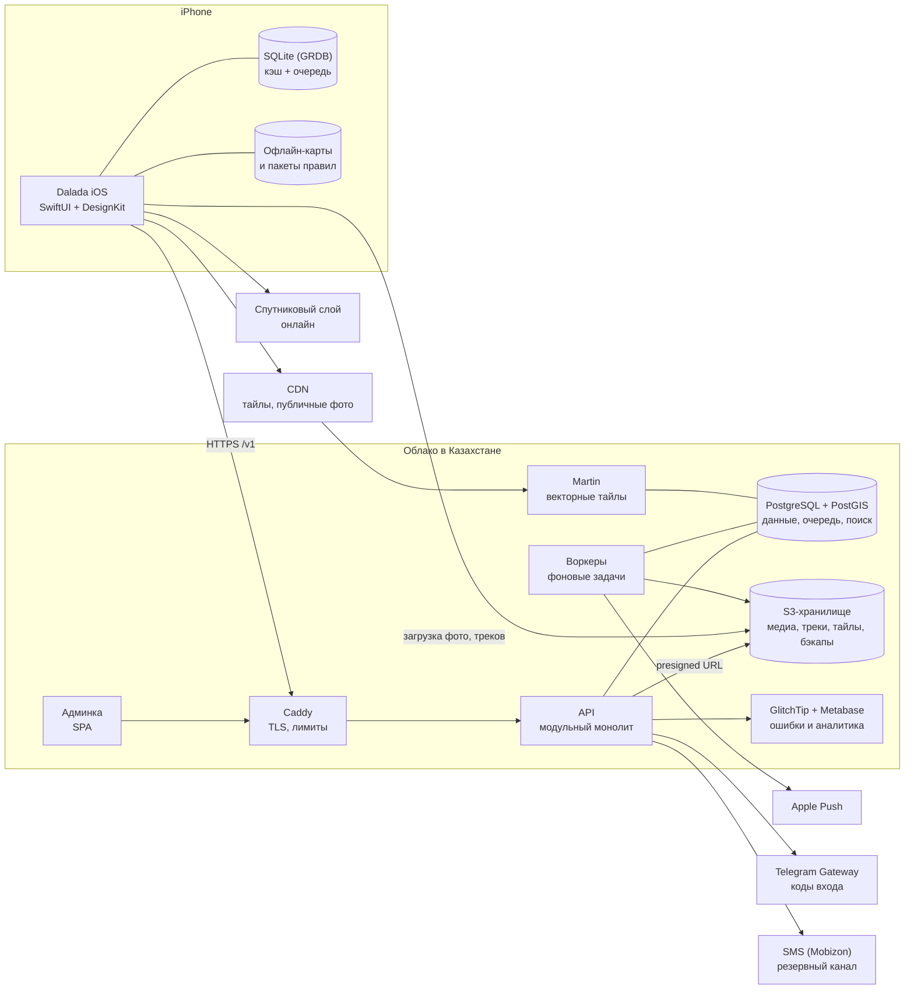

# 03. Архитектура и стек

> Этап 3 из 5. Дата: 2026-09-29. Основа — [план продукта](../02-plan/README.md) и
> [принятые решения](../00-product-brief.md#принятые-решения).
> Статусы: **предложено** — моя рекомендация, можно менять; **нужно решение** — жду вашего выбора.

| Документ | О чём |
|----------|-------|
| [01-ios-app.md](01-ios-app.md) | iOS-приложение: модули, экраны, локальная БД и офлайн, запись трека, карта, вход, локализация, тесты |
| [02-backend.md](02-backend.md) | Бэкенд: стек, модули, API, авторизация по телефону, модель данных, приватность в коде, медиа, уведомления, админка |
| [03-maps-geo.md](03-maps-geo.md) | Карты и геоданные: SDK, свои тайлы, офлайн-пакеты, спутник, правила на карте, навигация, роутинг |
| [04-infra.md](04-infra.md) | Инфраструктура: хостинг в РК, окружения, CI/CD, мониторинг, безопасность, бэкапы, затраты |

## Что определяет архитектуру

1. **Один разработчик (+ Claude).** Минимум движущихся частей, готовые решения вместо своих,
   один язык там, где можно, всё автоматизировано. Postgres — единственная stateful-зависимость:
   в нём данные, очередь задач и поиск.
2. **Персональные данные — в Казахстане.** База, медиа, треки, бэкапы, логи с ПД — в облаке в РК.
   Сторонним сервисам — только то, без чего нельзя (коды входа, пуши), и с согласия пользователя.
3. **Офлайн в поле.** Локальная БД на устройстве — источник правды для экранов; всё созданное без
   сети уходит из очереди, когда сеть появится.
4. **Приватность мест.** Сервер никогда не отдаёт точные координаты тому, кому они не видны.
   Никакой передачи геолокации третьим лицам (поэтому осторожно с картографическими SDK с телеметрией).
5. **Android позже.** API не зависит от платформы; контракт — OpenAPI.
6. **Нулевой бюджет на старте.** Без поминутно тарифицируемых SaaS; бесплатные open-source компоненты.

## Схема системы



## Ключевые решения

| # | Область | Предложение | Альтернатива | Статус |
|---|---------|-------------|--------------|--------|
| D1 | Форма бэкенда | Модульный монолит + воркеры в одном кодовом репозитории; Postgres — и БД, и очередь, и поиск | Микросервисы; Supabase self-hosted (~10 сервисов в эксплуатации) | Предложено |
| D2 | **Язык бэкенда** | **TypeScript** (Node.js 24 LTS, Fastify) — один язык для API, админки и веб-страниц | Swift (Vapor) — один язык с iOS | **Нужно решение** |
| D3 | База данных | PostgreSQL 17 + PostGIS + pg_trgm | — | Предложено |
| D4 | Контракт API | REST `/v1` + OpenAPI 3.1; Swift-клиент генерируется (Apple swift-openapi-generator) | GraphQL | Предложено |
| D5 | Вход | Телефон: Telegram Gateway → SMS (Mobizon); Sign in with Apple, Google; JWT + refresh | Firebase Auth (данные вне РК) | Предложено |
| D6 | **Карта на iOS** | **MapLibre Native** + свои векторные тайлы из OpenStreetMap в РК | Mapbox SDK — быстрее старт, но телеметрия геолокации и оплата за MAU после 25 тыс. | **Нужно решение** |
| D7 | Спутник | Онлайн-слой стороннего провайдера, без офлайна | Свой офлайн-спутник — дорого | Предложено |
| D8 | Локальная БД на iOS | GRDB (SQLite) + очередь операций (outbox) | SwiftData | Предложено |
| D9 | Архитектура iOS | SwiftUI, `@Observable` MVVM, SPM-модули по фичам, Swift 6 | TCA | Предложено |
| D10 | Хостинг | Облако в РК: VM + управляемый PostgreSQL + S3; Docker Compose, без Kubernetes | Kubernetes | Предложено; **провайдер — выбрать** |
| D11 | Админка | React + Refine в том же монорепо | Directus (готовая CMS) | Предложено |
| D12 | Ошибки и аналитика | GlitchTip (open-source, совместим с Sentry SDK) и свои события в Postgres + Metabase — всё в РК | Sentry SaaS, PostHog | Предложено |
| D13 | CI/CD | GitHub Actions (бэкенд, админка, тайлы) + Xcode Cloud (iOS → TestFlight) | fastlane на своих раннерах | Предложено |
| D14 | Роутинг (1.1) | Valhalla в РК: пешие маршруты с учётом сложности троп, авто по грунтовкам | GraphHopper | Предложено на 1.1 |

## Структура репозитория (монорепо)

```
dalada/                        (сейчас — Camping; переименовать по желанию)
├── ios/
│   ├── project.yml            XcodeGen, как в DesignKit Gallery
│   ├── Dalada/                таргет приложения: сборка зависимостей, навигация
│   ├── DaladaWidgets/         Live Activity
│   └── Packages/              локальные SPM-модули (Core, фичи, UI)
├── backend/                   API, воркеры, SQL-миграции
├── admin/                     админка (React + Refine)
├── web/                       страницы для шаринга (1.1)
├── geo/                       сборка тайлов, стили карты, скрипты импорта OSM и DEM
├── contracts/openapi.yaml     контракт API (генерируется бэкендом, коммитится)
├── infra/                     docker-compose, Caddyfile, скрипты деплоя
└── docs/
```

TypeScript-части (`backend`, `admin`, `web`) — один pnpm workspace.

## Технические спайки перед разработкой

Проверяем самые рискованные места прототипами (1–2 недели) до основной разработки:

| # | Спайк | Критерий успеха |
|---|-------|-----------------|
| S1 | MapLibre + свои тайлы: сборка тайлов Казахстана, стиль с казахскими подписями, офлайн-пакет «Капшагай и Иле» | Пакет < 150 МБ, скачивается < 3 мин по 4G, карта плавная на iPhone двухлетней давности |
| S2 | Запись трека 8 часов в фоне; выгрузка приложения системой; Live Activity | ≤ 25% батареи за 8 ч в «Экономном» режиме; трек не теряется |
| S3 | Вход по телефону: Telegram Gateway + Mobizon + App Attest | Код приходит < 15 с; без App Attest код не отправляется |
| S4 | PostGIS на управляемом PostgreSQL выбранного провайдера | Расширения `postgis`, `pg_trgm`, `unaccent` ставятся; бэкапы с восстановлением на момент времени |

## Оценка затрат (в месяц, бета и первые месяцы)

Оценка до получения коммерческих предложений провайдеров.

| Статья | Оценка |
|--------|--------|
| VM 4 vCPU / 8 ГБ: API, воркеры, Martin, GlitchTip, Metabase | ~20–35 тыс. ₸ |
| Управляемый PostgreSQL 2 vCPU / 8 ГБ / 50 ГБ + бэкапы | ~25–45 тыс. ₸ |
| S3 + CDN (до ~200 ГБ, трафик тайлов и фото) | ~5–20 тыс. ₸ |
| Staging (маленькая VM + маленькая БД) | ~10–15 тыс. ₸ |
| Коды входа: Telegram Gateway — $0,01 за код; SMS Mobizon — 60,8 ₸ (общая подпись) | ~5–30 тыс. ₸ при 1–3 тыс. входов |
| Спутниковый слой | $0–25 (зависит от провайдера и объёма) |
| Apple Developer Program | $99 в год |
| Домен `dalada.app` | ~$15–20 в год |
| **Итого** | **~70–150 тыс. ₸ в месяц** |

Своя подпись отправителя SMS («Dalada») у Mobizon стоит 14,5–20,8 тыс. ₸ в месяц за каждого
оператора (~52,7 тыс. ₸ за трёх), зато SMS дешевле — 16,6–17,8 ₸. Окупается примерно при 1 200+ SMS в месяц.

## Вопросы к Этапу 3

1. **Язык бэкенда (D2).** Рекомендую TypeScript: один язык для API, админки и веб-страниц, больше
   готовых библиотек. Swift (Vapor) — если важнее писать всё на одном языке с iOS. Плюсы и минусы — в
   [02-backend.md](02-backend.md#язык-typescript-или-swift).
2. **Карта (D6).** Рекомендую MapLibre + свои тайлы: бесплатно при любом числе пользователей,
   данные и треки не уходят третьим лицам, стиль полностью наш. Mapbox — на 2–3 недели быстрее
   старт. Сравнение — в [03-maps-geo.md](03-maps-geo.md#выбор-sdk).
3. **Хостинг (D10).** Есть ли предпочтения или аккаунт у провайдера в РК? Если нет — предлагаю
   запросить предложения у PS Cloud и Yandex Cloud (регион kz1) с вопросом про PostGIS.
4. **Telegram Gateway.** Коды входа через Telegram в 3–12 раз дешевле SMS, но номер телефона уходит в
   Telegram (за пределы РК). Согласны (с пунктом в согласии на обработку ПД)? Иначе — только SMS.
5. **Домен и репозиторий.** `dalada.app`, по данным реестра, свободен — зарегистрировать сейчас?
   Переименовать репозиторий в `dalada`?
